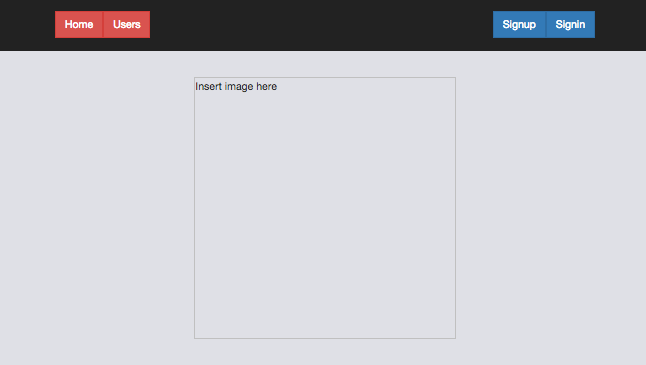
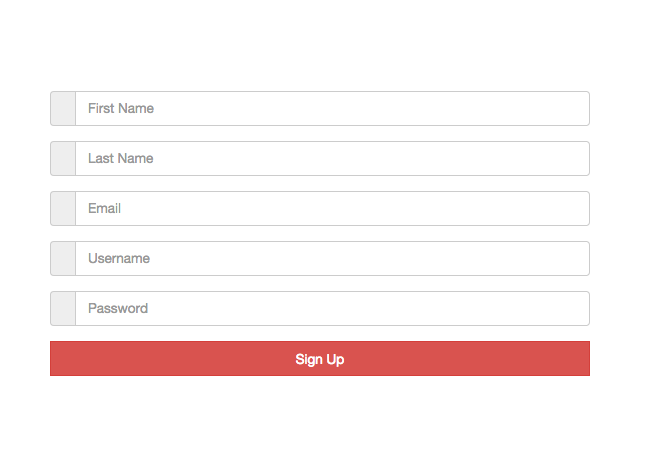

## Overview
A boilerplate template for getting started with the MEAN stack. A custom-built RESTful API resides in the backend.

The template features a fully functional user signup/login system built using Passport and a basic User model.

## Getting started
```git clone https://github.com/Alaanzr/mean-stack-template.git```

```cd mean-stack-template```

Install dependencies:
```npm install```
```bower install```

The authentication system is linked to a User model via a local database, therefore MongoDB needs to be installed and the mongod process needs to be running prior to launching the application. To download MongoDB, please follow this link:

https://www.mongodb.com/collateral/mongodb-3-2-whats-new?_bt=90293194723&_bk=download%20mongodb&_bm=e&jmp=search&utm_source=google&utm_campaign=Sitelink&utm_keyword=download%20mongodb&utm_device=c&utm_network=g&utm_medium=cpc&utm_matchtype=e&utm_creative=90293194723&_bt=90293194723&_bk=download%20mongodb&_bm=e&gclid=Cj0KEQiAl5u2BRC6yszC1_75v5wBEiQAD-hdzzGGuEZz_GiuJDyl42Av6YjNK-VaxLQosBFusEnW90EaAj368P8HAQ

To launch the application:

```mongod``` ```node server.js```

### Preview



